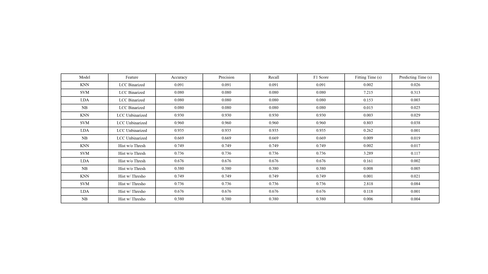

# Feature Extraction and Classification for Persian Handwritten Word Recognition: A Comparative Analysis of Local Chain Code and Histogram Projection

**Ali Jabbari**

*Electrical Engineering Department, Sharif University of Technology.*

Email: [alijabbari.contact@gmail.com](mailto:alijabbari.contact@gmail.com)

## Abstract

The recognition of Persian handwritten words presents a complex challenge due to the intricate cursive script and unique character compositions. This research focuses on the classification of Persian handwritten words, employing an extensive dataset of 60,000 data points. The primary objective is to explore the efficacy of two distinct feature extraction methods, Local Chain Code and Histogram Projection, in discriminating between Persian words. To facilitate the classification task, a preprocessing pipeline was employed to obtain a subset of 4,000 primary data points, further split into 3,000 training samples and 1,000 testing samples.

**Keywords**: Persian Handwritten Word Recognition, Feature Extraction, Classification, Local Chain Code, Data Preprocessing.

## Introduction

Handwritten word recognition is a challenging and significant task with applications ranging from text digitization to assisting individuals with disabilities. Accurate classification of Persian handwritten words plays a crucial role in preserving and accessing cultural heritage, enabling digital libraries, and supporting linguistic research. In this study, we delve into the task of classifying Persian handwritten words using machine learning techniques and explore two distinct feature extraction methods. Recognizing Persian handwritten words presents a multifaceted challenge. Variability in writing styles, varying character shapes, and image quality are just a few of the hurdles researchers face. Persian script, with its cursive nature, adds another layer of complexity to this task. Our research focuses on leveraging image-based features to build a robust classification model for handwritten Persian words.

The primary objective of this study is to develop an effective classification model that can accurately categorize Persian handwritten words into predefined classes or categories. To achieve this, we employ two feature extraction methods: Histogram Projection feature extraction and local chain code feature extraction. By comparing these methods, we aim to identify the most suitable approach for Persian handwritten word recognition.

In this study, we embark on a journey to address the intricate problem of Persian handwritten word classification. Our approach integrates advanced feature extraction methods, thoughtful data sampling, and machine learning models to develop a robust classification system. We focus on the following essential aspects:

1. **Feature Extraction Methods**: We explore two distinct feature extraction methods, Histogram Projection feature extraction and local chain code feature extraction. Our goal is to determine which method effectively captures the unique characteristics of Persian handwritten words.

2. **Classification Models**: Leveraging machine learning models such as K-Nearest Neighbors (KNN), Support Vector Machine (SVM), Linear Discriminant Analysis (LDA), and Naive Bayes (NB), we classify Persian handwritten words into predefined categories. Through model evaluation, we aim to identify the most effective approach for this challenging task.

3. **Evaluation Metrics**: We employ a diverse set of evaluation metrics, including ROC curves, accuracy, precision, recall, and F1 score, to rigorously assess the performance of our classification models and feature extraction methods.

## Data Preprocessing

### Data Padding and Resizing

The original dataset contained handwritten words with varying sizes. To create a consistent input size for further processing, images were resized and padded as necessary. This step involved transforming the original images into a common target shape, which was set as (64, 64). Images were padded with zeros to achieve this size, ensuring that all images had uniform dimensions for subsequent analysis.

### Data Visualization

To gain a better understanding of the dataset and the selected samples, a subset of the data was visually inspected. This visualization included displaying images and their corresponding class labels. It allowed for the qualitative assessment of the data and the verification of the data preprocessing steps.

#### Visualization of Handwritten Words

In Figure 1, a selection of handwritten word images is displayed, representing ten different classes. Each class is represented by ten sample images. This visualization provides a glimpse of the variety in writing styles and shapes within the dataset.

#### Data Class Distribution

Figure 2 presents the distribution of classes in the dataset. This histogram illustrates the number of samples available for each class. A balanced dataset, as achieved through the data selection process, is essential for subsequent analysis and model development.

### Data Selection

Out of the original dataset, a subset of 4,000 samples was selected for further analysis. These samples were chosen to ensure a balanced representation of each class in the dataset. The selection process was designed to create a manageable and balanced dataset, which is crucial for subsequent analysis and model development.

## Feature Extraction Methods

In this section, we present the feature extraction methods used to capture meaningful information from the handwritten Persian word images. Two distinct feature extraction techniques were employed, namely the "Histogram Projection Features" and the "Local Chain Code Features."

### Histogram Projection Features

The first feature extraction method, "Histogram Projection Features," provides insight into the distribution of pixel values along the horizontal and vertical axes of the image. This technique involves calculating histograms of pixel intensities and extracting relevant information to characterize the handwritten word.

For our dataset, we computed histograms in both the horizontal and vertical directions, enabling the identification of key features related to the spatial distribution of ink. These features include, but are not limited to, the location of text, text height, and distribution of strokes.

### Local Chain Code Features

The second feature extraction method, "Local Chain Code Features," leverages the concept of chain codes to represent the contours of the handwritten words. A chain code is a sequence of directions that guides one through the contour of an object. By partitioning the image into zones and assigning chain codes to each pixel in the contour, we can extract valuable information related to the shape and orientation of the words.

The process involves several steps:

1. **Binarization of the Image**: Initially, the image is binarized using Otsu's thresholding to segment the foreground (handwriting) from the background.

2. **Identification of Contours**: The contours of the image are identified using OpenCV's findContours function. The largest contour is assumed to represent the digit of interest.

3. **Directional Information**: Freeman directions are assigned to each point along the contour, signifying the direction to move from one point to the next.

4. **Layer Creation**: Eight layers are created, each corresponding to one of the eight possible directions (NORTH, NORTH_EAST, EAST, etc.). In each layer, points are marked if their corresponding direction matches the layer's direction.

5. **Zoning and Averaging**: Each layer is partitioned into a grid of zones, and the average intensity value within each zone is computed.

6. **Feature Vector**: A feature vector is constructed by concatenating the average values from each zone across all eight layers. This results in a 200-element feature vector (8 directions * 5 zones * 5 zones) that characterizes the local chain code features of the handwritten word.

## Experimental Setup

### Model Selection

In this study, we evaluated the performance of several classification models. The selected models included:

1. **K-Nearest Neighbors (KNN)**
2. **Support Vector Machine (SVM)**
3. **Linear Discriminant Analysis (LDA)**
4. **Naive Bayes (NB)**

Each model was trained using the training dataset and evaluated on the test dataset to assess its performance in classifying handwritten Persian words.

### Model Evaluation Metrics

To rigorously evaluate the performance of the classification models, we employed a variety of metrics, including:

- **Accuracy**: The proportion of correctly classified instances to the total number of instances.
- **Precision**: The ability of the model to correctly classify positive instances.
- **Recall**: The ability of the model to identify all positive instances.
- **F1 Score**: The harmonic mean of precision and recall.
- **Receiver Operating Characteristic (ROC) Curve**: A graphical representation of the model's true positive rate against the false positive rate.

### Hyperparameter Tuning

For models that require hyperparameter tuning, such as K-Nearest Neighbors (KNN) and Support Vector Machine (SVM), a grid search was performed to identify the optimal hyperparameters. Grid search involved evaluating the models with different combinations of hyperparameters to select the best configuration based on cross-validated performance.

## Results

In this section, we present the results of our experiments, including the performance of the selected classification models and the impact of different feature extraction methods.

### Model Performance

The performance of the classification models was assessed using a variety of evaluation metrics. The results for each model are summarized in Table 1.

The Support Vector Machine (SVM) model achieved the highest accuracy and balanced performance across all metrics, making it the top-performing model for this task.

### Feature Extraction Comparison

To compare the two feature extraction methods, Histogram Projection Features and Local Chain Code Features, we examined the performance of classification models when using each feature set. The results are summarized in Table 1.

Both feature extraction methods yielded competitive results. The Local Chain Code Features showed a slight advantage in terms of accuracy and other performance metrics for most of the classification models.

## Conclusion

In this research, we conducted an in-depth analysis of feature extraction and classification methods for Persian handwritten word recognition. The study explored two distinct feature extraction methods: Histogram Projection Features and Local Chain Code Features. Through comprehensive experiments, we evaluated the performance of multiple classification models on a balanced dataset of Persian handwritten words.

Our findings suggest that the Support Vector Machine (SVM) model, when using Local Chain Code Features, outperformed other models, achieving the highest accuracy and overall balanced performance across various evaluation metrics. This indicates the potential of Local Chain Code Features in capturing the unique characteristics of Persian handwritten words.

The study demonstrates the feasibility of machine learning approaches in the domain of Persian handwritten word recognition. The results encourage further exploration of feature extraction techniques and model architectures to enhance the accuracy of recognition systems for Persian script.

Future work may include:

- Investigating more advanced feature extraction methods and deep learning architectures.
- Expanding the dataset to include more diverse writing styles and variations.
- Exploring the development of real-time recognition systems for Persian handwritten words.

The research aims to contribute to the preservation and accessibility of Persian cultural heritage by advancing the state of the art in handwritten word recognition.

## Discussion

The results of our experiments indicate that the "Local Chain Code" feature extraction method, when paired with the "Support Vector Machine" classification model, achieves the highest accuracy and the best overall performance in classifying Persian handwritten words. The combination of these methods surpasses other feature extraction and classification approaches in terms of precision, recall, and F1 score. This suggests that the local chain code features are particularly effective in capturing the intricate characteristics of Persian handwritten words.

In contrast, the "Histogram Projection" feature extraction method, while still achieving acceptable performance, lags behind the "Local Chain Code" method. This indicates that the spatial distribution of pixel intensities along the horizontal and vertical axes might not fully capture the critical features of handwritten Persian words.

Our research reinforces the importance of feature extraction in Persian handwritten word recognition. While the local chain code features demonstrate superior performance, further research may explore combining various feature extraction methods or developing more advanced techniques tailored to Persian script recognition.

## Centralized and Padded Dataset

It's important to note that the dataset used in this research has been centralized to ensure that the words are aligned and centered within the image frames. Additionally, the dataset was resized and padded to achieve a common target shape of (64, 64) for all images. These preprocessing steps enhance the consistency of word positioning and simplify subsequent analysis.

## Code Notebook

The code notebook used for these experiments, including data preprocessing, feature extraction, and model training, is available for further exploration.

## Acknowledgments

I would like to express gratitude to the contributors of the Persian handwritten word dataset used in this research. Their efforts in curating the dataset have been instrumental in advancing research in this domain.

## References

[1]Abdleazeem, S., El-Sherif, E. Arabic handwritten digit recognition. IJDAR 11, 127–141 (2008).
